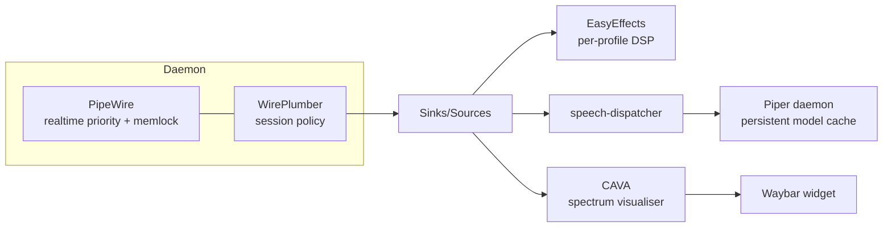

# Audio stack

PipeWire as the daemon, WirePlumber as the session manager, EasyEffects for per-device DSP, and Piper (via speech-dispatcher) for text-to-speech. Cava drives the Waybar visualiser.



## PipeWire — realtime + memlock

`~/.config/pipewire/pipewire.conf.d/51-memlock.conf` raises realtime scheduling priority (`rt.prio = 88`) and locks all PipeWire memory (`mem.mlock-all = true`) to keep the audio thread off swap.

```ini
context.modules = [
  { name = libpipewire-module-rt
    args = { rt.prio = 88; rt.time.soft = 200000; rt.time.hard = 400000 }
    flags = [ ifexists nofail ]
  }
]
context.properties = { mem.mlock-all = true }
```

## WirePlumber — safe defaults

Two drop-ins under `~/.config/wireplumber/wireplumber.conf.d/`.

| File | Purpose |
|---|---|
| `50-safer-default-volume.conf` | Cap default volume at **30 %** when a new device connects. Prevents "ear rape" on Bluetooth headphone (re)connect. |
| `51-mic-soft-mixer.conf` | Force `api.alsa.soft-mixer = true` on the built-in audio card so the KDE volume slider becomes pure software volume — WirePlumber/ACP stop touching `Capture` / `Internal Mic Boost` / `Headset Mic Boost`. |

!!! note "Property scope gotcha"
    `api.alsa.soft-mixer` is a **device-level** property, not node-level. Match on `device.name`, not `node.name`.

## EasyEffects — per-device DSP

`~/.config/easyeffects/` ships a substantial preset library:

- **Output presets** (28): `Mae Laptop`, `Mae Laptop Headphones`, `Bose`, `Sony`, `Spark 2`, `Bass Boosted`, `Bass Enhancing + Perfect EQ`, `Loudness+Autogain`, `Music`, `Video`, `Room`, `Boosted`, `Default`, `ECHOOO`, `Advanced Auto Gain`, `Perfect EQ`, `Laptop`
- **Input presets** (2): `Fifine Mic`, `Laptop Mic`
- **Impulse responses (IRS)**: 14 — Accudio variants for common headphones (MDR-E9LP, XBA-H3, Earpods, MDR-XB500), Creative X-Fi Crystalizer, Dolby ATMOS, HTC Beats, MaxxAudio, Razor Surround, Waves
- **Autoload bindings**: per-device autoload rules in `autoload/output/` for the laptop's analog output and three Bluetooth headsets

The `Mae Laptop*` presets are the daily drivers — autoload triggers them by device name.

## Speech-dispatcher + Piper

| Path | Role |
|---|---|
| `~/.config/speech-dispatcher/speechd.conf` | Top-level config — output module, default voice, language |
| `~/.config/speech-dispatcher/modules/piper-generic.conf` | sd_generic module that delegates synthesis to `piper/run.sh` |
| `~/.config/speech-dispatcher/piper/daemon.py` | Persistent Piper daemon keeping models loaded in RAM |
| `~/.config/speech-dispatcher/piper/run.sh` | sd_generic-invoked synthesiser — talks to the daemon over a Unix socket |
| `~/.config/speech-dispatcher/piper/client.py` | Daemon client used by `run.sh` |
| `.config/systemd/user/piper-daemon.service` | systemd unit for the daemon |

### Voice catalogue (current)

| Code | Voice | Model |
|---|---|---|
| `en` `FEMALE1` | aru | `en_GB-aru-medium.onnx` |
| `en` `FEMALE2` | southern_english_female | `en_GB-southern_english_female-low.onnx` |
| `en` `FEMALE3` | cori (default) | `en_GB-cori-high.onnx` |
| `en` `FEMALE4` | semaine | `en_GB-semaine-medium.onnx:0` |
| `en` `MALE1` | semaine | `en_GB-semaine-medium.onnx:2` |
| `en` `MALE2` | semaine | `en_GB-semaine-medium.onnx:1` |
| `en` `CHILD_FEMALE` | semaine | `en_GB-semaine-medium.onnx:3` |
| `en-US` `FEMALE1` | lessac | `en_US-lessac-medium.onnx` |
| `en-US` `FEMALE2` | GLaDOS | `glados_piper_medium.onnx` |

`en` is a catch-all matching `en-IE` / `en-GB` / `en-AU` via SD's language fallback. Default voice: **cori** (high quality).

### Why a daemon?

Piper takes ~1.5 s to load a model. The daemon keeps every active model resident in RAM and exposes a Unix socket. `run.sh` talks to the socket per-utterance, so synthesis latency drops from ~2 s to ~50 ms.

!!! warning "sd_generic variable-name footgun"
    `sd_generic` greedily substitutes `VOICE` / `DATA` / `RATE` / `PITCH` / `VOLUME` before passing the command string to `sh`. Inner shell variables must use other names (`MODEL`, `SPK`, `SR`) — or be quoted with `\"$VOICE\"`-style escaping as in `piper-generic.conf`.

## CAVA — terminal spectrum visualiser

`~/.config/cava/config` plus three GLSL shaders (`shaders/bar_spectrum.frag`, `northern_lights.frag`, `pass_through.vert`) and a Waybar-tuned config (`waybar.conf`). Wired into Waybar as the centre-panel audio visualiser (128 bars, Catppuccin palette).

## Recovery

If `spd-say` returns "Speech Dispatcher already running" but the socket refuses connections:

```bash
pkill -9 -f speech-dispatch
rm -f /run/user/$UID/speech-dispatcher/{speechd.sock,pid/*}
spd-say "test"   # autospawn rebuilds cleanly
```

## Related

- [systemd user units](systemd-user-units.md) — `piper-daemon.service` lifecycle
- [Pomodoro timer](pomodoro.md) — uses `spd-say` for voice lines
- [Memory management](memory-management.md) — Piper daemon RSS budget
