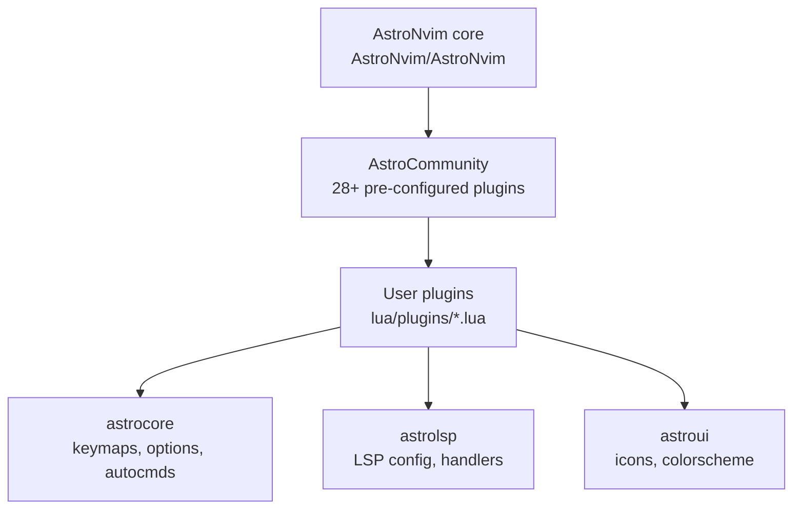

# Neovim

Mae's editor: **AstroNvim v4** with custom plugin overrides. The config lives at `~/.config/nvim/` as its own git repo, tracked here as a submodule. The detailed in-tree spec — including LSP edge cases, plugin lazy-loading rules, and Claude Code editing conventions — is `~/.config/nvim/CLAUDE.md`.

## Stack



## Layout

```
~/.config/nvim/
├── init.lua                # bootstraps lazy.nvim
├── lua/
│   ├── lazy_setup.lua      # plugin manager setup
│   ├── community.lua       # AstroCommunity imports (load order matters)
│   ├── polish.lua          # final setup (filetypes, line endings)
│   └── plugins/            # custom plugin overrides
└── snippets/               # custom LuaSnip snippets
```

Import order: **AstroNvim core** → **AstroCommunity** → **user plugins**. Community must load before user plugins so user files can override.

## Language support

| Language | LSP | Notes |
|---|---|---|
| Python | `basedpyright` | NOT pyright — pyright explicitly disabled in `astrolsp` handlers. Mason auto-installs. `venv-selector` integration configured. |
| Prolog | SWI-Prolog | Manual LSP config — not available via Mason. Filetypes: `.pl` / `.pro` / `.P` → `prolog`. |
| Go | `gopls` | Needs Go 1.25+. Fedora ships 1.24 — workaround: `go env -w GOTOOLCHAIN=auto` then retry Mason install. |
| SQL / CQL | CQL LS for Cassandra | Custom `.cql` filetype. **SQLFluff** formatter configured for postgres dialect. |

## Notable plugin choices

| Plugin | What it does |
|---|---|
| **hop.nvim** | EasyMotion-style jumps with `<leader><leader>` prefix |
| **obsidian.nvim** | Two vault workspaces — `tu856` (academic) + `personal` (`~/Documents/The Nexus Vault`) |
| **smear-cursor.nvim** | Particle-trail cursor animation (size + lifetime tuned for performance) |
| **mini.animate** | Buffer/window animations |
| **catppuccin** | Macchiato theme, matches the rest of the desktop |
| **render-markdown** | In-buffer markdown rendering |
| **table-mode** | Markdown/text table editing |

## Day-to-day commands

```bash
# Sync plugins
nvim                # auto-installs on first run
:Lazy sync          # update everything
:Lazy clean         # remove unused
:Lazy restore       # reset to lazy-lock.json
:Mason              # manage LSP/formatters/linters

# Lint + format the Lua config
selene lua/
stylua lua/ --check
stylua lua/ --write

# Sync the submodule from anywhere
nvim-sync           # see CLI tools reference
```

## Conventions

- **Lazy loading is mandatory** — prefer `event`, `ft`, `cmd`, `keys` over eager loading.
- **Full GitHub paths in plugin specs** — `"smoka7/hop.nvim"`, not `"hop-nvim"`. lazy.nvim requires the `author/repo` form.
- **Unix line endings everywhere** — enforced in `polish.lua`.
- When using a `config = function(_, opts)` block, always call `setup(opts)` explicitly — `opts` alone won't initialise the plugin.

## Troubleshooting

### Plugin won't load

1. Confirm full `author/repo` path (not shorthand).
2. Check the lazy-loading trigger (`event` / `ft` / `cmd` / `keys`).
3. Inspect `lazy-lock.json` for a version pin.
4. `:Lazy restore` to reset to the lockfile state.

### LSP issues

- Servers live in `~/.local/share/nvim/mason/`.
- Logs: `:LspLog` or `~/.local/state/nvim/lsp.log`.
- For Python, ensure `pyright` is **not** in Mason handlers — `basedpyright` only.

### Community plugin override not taking effect

- Override file in `lua/plugins/` must use the full `"author/repo"` path.
- The `community.lua` import must come **before** the user plugin in load order.
- Some plugins set a custom `name` field (e.g. catppuccin) — match it.

### Clean reinstall

```bash
rm -rf ~/.local/share/nvim ~/.local/state/nvim ~/.cache/nvim
nvim   # reinstalls everything from lazy-lock.json
```

## Related

- [Shell environment](shell.md) — `nv` alias, `EDITOR=nvim`, `MANPAGER=nvim +Man!`
- [CLI tools — `nvim-sync`](../reference/cli-tools.md) — submodule push/pull from anywhere
- `~/.config/nvim/CLAUDE.md` — full in-tree spec (read by Claude Code when editing nvim config)
