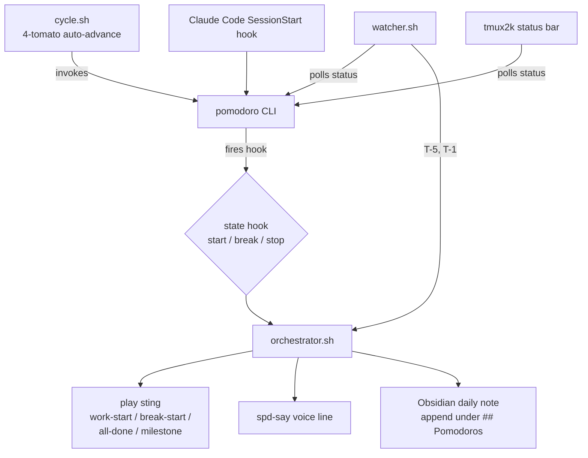

# Pomodoro timer

A CLI-driven pomodoro timer that **interrupts, speaks, and logs** — replacing the silent `tmux-pomodoro-plus` plugin. Built around [`openpomodoro-cli`](https://github.com/open-pomodoro/openpomodoro-cli) with custom orchestration scripts, sox-generated stings, and Obsidian daily-note logging.

## Why

The previous tmux plugin was passive: a status-bar number, no audio, no record of what was actually worked on. This setup adds:

- **Audio cues** at every transition (start, break, complete, T-5 min, T-1 min)
- **Spoken voice lines** with task name, tomato number, daily progress
- **Daily-note logging** into Obsidian under a `## Pomodoros` heading
- **Live tmux indicator** via `tmux2k`
- **Claude Code context injection** so any active session sees pomodoro state

## Architecture



## Components

| File | Role |
|---|---|
| `~/.config/pomodoro/cycle.sh` | Blocking 4-tomato loop (work → break → … → long break) |
| `~/.config/pomodoro/watcher.sh` | Polls status; fires T-5 and T-1 milestone announcements |
| `~/.config/pomodoro/orchestrator.sh` | Invoked by hooks; plays sting, speaks line, logs to Obsidian |
| `~/.config/pomodoro/design-sounds.sh` | Reproducibly regenerates the four sox stings |
| `~/.pomodoro/hooks/{start,break,stop}` | Thin shims that delegate to `orchestrator.sh` |

The CLI itself is **not a daemon** — state is file-based. A tmux pane running `cycle.sh` provides the blocking "long process"; `tmux-resurrect` keeps it alive across restarts.

## Paths

| Path | Contents |
|---|---|
| `~/.pomodoro/{settings,current,history/,hooks/}` | State (hardcoded by `openpomodoro-cli`) |
| `~/.config/pomodoro/` | Custom scripts + sounds (in this repo) |
| `~/.pomodoro/_cache/` | DESC/TAGS bridge from `start` → `break`/`stop` |
| `~/Documents/Computer Science TU856/Year 4/logs/YYYY-MM-DD.md` | Daily-note target |

## Audio

### Voice

`spd-say -w` (speech-dispatcher), default voice `cori` (`en_GB-cori-high`).

### Stings

All sox-generated, stereo 44.1 kHz, lo-fi minimal aesthetic with timer character. Bell chords normalised to `-1` (max pre-clip), final `norm -6` after reverb, 1.5 s trailing silence so the reverb tail decays naturally.

| File | Role | Design |
|---|---|---|
| `work-start.wav` | Focus session start | 2-bar swung triangle motif in C major over C4 tonic pedal bass |
| `break-start.wav` | Tomato done, break begins | 4-bar Em – C – D – Em; swung triangle melody bars 1–3 (5-3-1-3 chord tones); bar 4 = staggered Em triad (E-G-B, 80 ms offsets) with sine bell partials, 4 s log decay |
| `all-done.wav` | Cycle complete | 4-bar C – F – G – C; same motif; bar 4 = staggered C triad (C-E-G), sine bell partials, 4 s decay |
| `milestone.wav` | T-5 / T-1 warning | 6 swung triangle ticks (1800 / 1500 Hz), clock-pendulum feel, subtle bass thumps on long positions |

Swing ratio: **2:1** (long 0.33 s, short 0.17 s per pair).

### Voice content

| State | Line |
|---|---|
| `start` | "Focus session started. Tomato N of 4. Task: DESC. X of GOAL done today." |
| `break` | "Tomato complete. Take a break. Finished: DESC. X of GOAL done today." |
| `stop` | "Session ended. X of GOAL done today." |
| Milestone | "5 minutes remaining." / "One minute remaining." |

`DESC`/`TAGS` caching: orchestrator saves them on the `start` hook and restores on `break`/`stop`, since the CLI's live state has already switched by then.

## Obsidian logging

Appends under a `## Pomodoros` heading in today's daily note. Creates the file and heading if missing.

```markdown
## Pomodoros
- 10:00 started — write section 3.3 [fyp]
- 10:25 complete — write section 3.3 (3/8)
- 11:40 session ended (7/8)
```

## Daily workflow

```bash
# In a dedicated tmux pane — blocks for the full cycle
cycle.sh "write §3.3" -t fyp

# From any other shell
pomodoro status
pomodoro history --json | jq .
```

## tmux status indicator

`~/.tmux/plugins/tmux2k/plugins/pomodoro.sh` polls `pomodoro status -f "%R/%L %c%!g"` and prints e.g. `🍅 18/25 2/8` when active, empty when idle. Wired in via `@tmux2k-right-plugins` as `pomodoro`.

## Claude Code integration

Hook at `~/.claude/hooks/pomodoro-context.sh` injects current state into Claude's context on:

- `SessionStart` — every time
- `UserPromptSubmit` — with a 15-min cooldown

So Claude always knows whether you're in a focus block and what the task is.

## Related

- [Shell environment](shell.md) — tmux setup that hosts the cycle pane
- [CLI tools reference](../reference/cli-tools.md)
