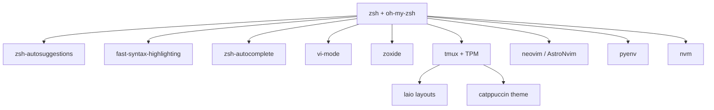

# Shell environment

The day-to-day terminal stack: zsh, tmux, neovim, and the per-language version managers. Configs are tracked in this repo; everything in this guide ships in `~/.zshrc`, `~/.tmux.conf`, and `~/.config/nvim/`.

## Stack overview



## zsh

| Slot | Value |
|------|-------|
| Theme | `robbyrussell` |
| Config | `~/.zshrc` |
| Aliases | `~/.zsh_aliases` |
| Functions | `~/.zsh_functions` |

### oh-my-zsh plugins

| Plugin | Purpose |
|---|---|
| `git` | Git aliases — see [Git aliases reference](../reference/git-aliases.md) |
| `zoxide` | `z <dir>` — frecency-based jump |
| `tmux` | Tmux aliases + auto-attach |
| `vi-mode` | Vi keybindings on the command line |
| `zsh-autosuggestions` | Fish-style ghost suggestions |
| `fast-syntax-highlighting` | Live command highlighting |
| `zsh-autocomplete` | Real-time menu completion |

### Custom aliases

| Alias | Expands to | Note |
|---|---|---|
| `vi` / `nv` | `vim` / `nvim` | |
| `cs` / `csp` | `cheat` / `cheat -p personal` | fzf-driven cheatsheets |
| `clip` | `wl-copy` | Wayland clipboard |
| `open` | `xdg-open` | |
| `restart-plasma` | `systemctl --user restart plasma-plasmashell.service` | |
| `docker-{start,stop,restart,status,log}` | `systemctl --user …` | Rootless Docker |
| `clm` | Browse all per-project Claude `MEMORY.md` via `bat` | |

### Custom functions

| Function | Purpose |
|---|---|
| `compress-video <file> [quality]` | NVENC GPU encode with CPU fallback |
| `libre2pdf <file>` | LibreOffice → PDF |
| `libre2pdf-batch <files…>` / `libre2pdf-all` | Batch variants |
| `cs <sheet> [term]` | Cheat with optional grep |
| `direnv_prompt_info` | Renders `direnv` state in `$PROMPT` |
| `odino <cmd>` | Walks parents for nearest `.odino`, then runs semantic search |

## tmux

| Slot | Value |
|------|-------|
| Plugin manager | [TPM](https://github.com/tmux-plugins/tpm) |
| Config | `~/.tmux.conf` |
| Theme | Catppuccin (v2.1.3) |
| Status bar | `tmux2k` |

### Plugins

| Plugin | Role |
|---|---|
| `tmux-sensible` | Sane defaults |
| `tmux-which-key` | Keybinding hints popup |
| `vim-tmux-navigator` | Seamless `Ctrl+hjkl` between vim and tmux |
| `tmux-tilit` | Tiling-WM-style pane management (`Alt+hjkl`) |
| `tmux-resurrect` + `tmux-continuum` | Persist sessions across restarts |
| `tmux-yank` | System clipboard integration |
| `extrakto` | Fuzzy-extract from terminal output |

### TPM keybindings

| Keys | Action |
|---|---|
| `Prefix + I` | Install plugins |
| `Prefix + U` | Update plugins |
| `Prefix + Alt+u` | Uninstall removed |

### tmux-tilit pane management

| Keys | Action |
|---|---|
| `Alt+hjkl` | Navigate panes |
| `Alt+Shift+hjkl` | Move panes |
| `Alt+Enter` | New pane |
| `Alt+/` / `Alt+-` | Horizontal / vertical split |
| `Alt+Shift+m` / `t` / `e` | Main-vertical / tiled / even-horizontal |
| `Alt+z` / `Alt+x` | Zoom toggle / close pane |

### Session quick-ref

```bash
tmux                # start or attach
ta <name>           # attach (oh-my-zsh alias)
tl                  # list
ts <name>           # new named
laio list           # list saved layouts
laio start <name>   # start layout
laio stop <name>    # stop layout
```

## Editor — neovim (AstroNvim)

| Slot | Value |
|------|-------|
| Distribution | [AstroNvim](https://github.com/AstroNvim/AstroNvim) v4+ |
| Config | `~/.config/nvim/` (own git repo, tracked here as a submodule) |
| Plugin manager | `lazy.nvim` |

The detailed plugin map, language-server choices, and Claude-Code integration notes live in `~/.config/nvim/CLAUDE.md` (read by Claude Code when editing nvim config).

## Version managers

### Python — pyenv

```bash
pyenv versions             # list installed
pyenv install <ver>        # install
pyenv local <ver>          # pin in current dir
```

```bash title="loaded in ~/.zshrc"
export PYENV_ROOT="$HOME/.pyenv"
eval "$(pyenv init - bash)"
eval "$(pyenv virtualenv-init -)"
```

### Node.js — nvm

Loaded in `~/.zshrc` with bash completion. Standard `nvm install/use` flow; per-project `.nvmrc` is honoured.

## Greeting

```bash
fortune | cowsay -f $(random cow) | lolcat -b
```

## Related

- [CLI tools reference](../reference/cli-tools.md) — env vars, file locations, the convert-pdf and build-memory utilities
- [Git aliases reference](../reference/git-aliases.md)
- [Memory management](memory-management.md) — leak watchdog scripts
