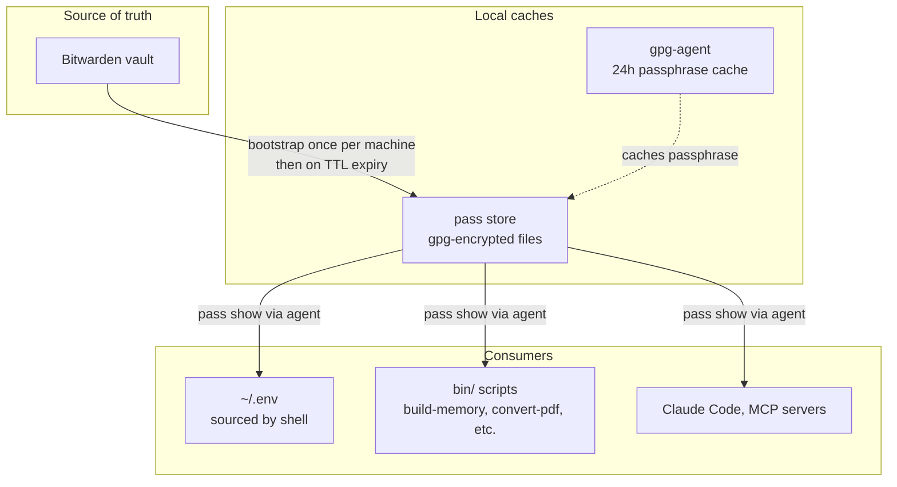
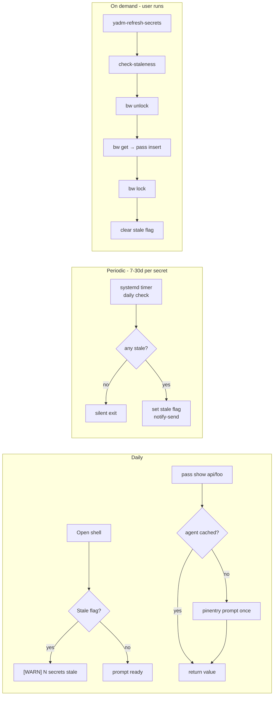
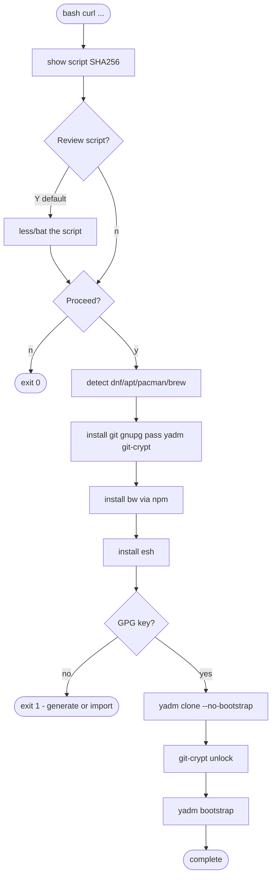
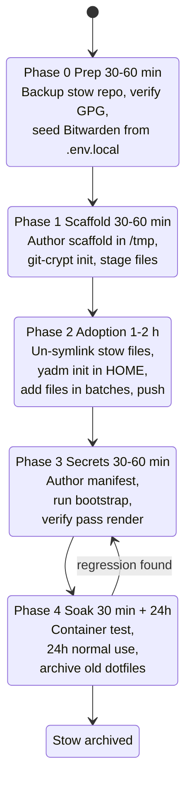

# Dotfiles Migration: Stow → yadm + pass + Bitwarden

- **Author:** cadrianmae
- **Date:** 2026-04-20
- **Status:** Draft — awaiting user review
- **Supersedes:** `~/dotfiles/` (GNU Stow layout, uncommitted since Oct 2025)

## 1. Context

Current state (`~/dotfiles/`): GNU Stow, no git remote, Oct 2025 staged changes unmerged. Coverage limited to `shell/`, `git/`, `bin/`, `easyeffects/` — nvim, tmux, `.claude/rules/`, `.config/speech-dispatcher`, `.config/pomodoro` and many others are untracked. Bitwarden currently contains no API keys; they live in `~/.env.local` and drift between machines.

Goals:

1. Real cross-machine parity for 2-3 similar Linux machines.
2. Secrets workflow where Bitwarden is source of truth but doesn't gate daily work.
3. Clear defence against accidental secret leakage to a public-ready repo.
4. One-command new-machine bootstrap.
5. Low tool lock-in — possible to walk away without rewriting everything.

## 2. Decision Summary

| Decision | Choice | Why |
|---|---|---|
| Dotfile manager | **yadm** | Real files in `$HOME`; feels like git; encryption + alternates built in; low lock-in (delete repo, files stay). |
| Template engine | **esh** | Single maintained shell script (~300 LOC); chezmoi's Go templates not available without chezmoi; yadm's `##template.default` too limited. |
| Secret sync | **Bitwarden → pass (one-time per machine)** | Decouples daily reads from Bitwarden unlock; `pass` usable by all shell scripts, not just dotfile rendering. |
| Encryption of docs | **git-crypt** | Transparent per-file encrypt/decrypt; editable like normal files; supported by yadm. |
| Secret manifest | **Single `manifest.yaml`, generated template (B.1)** | Single source of truth; generated `.env##template.esh` gitignored so nothing about secret shape committed. |
| Migration | **Big-bang**, phased over 5 stages with 24h soak | User doesn't rely on current setup heavily; cleanest cut. |
| GPG key | **Reuse existing `pass` key** | One key covers pass + yadm encrypt + git-crypt + commit signing. |
| gpg-agent TTL | **24h** | Pinentry once/day; rest of day transparent. |
| pass entry TTL | **Per-secret via manifest** (7d-30d typical, `never` for non-rotating) | Stale check detects drift from Bitwarden; forces periodic resync. |

## 3. Architecture



Three caches, three rhythms:

- **Bitwarden**: monthly-ish (rotation).
- **pass**: per-secret TTL (7-30d).
- **gpg-agent**: daily unlock.

Each layer's TTL is longer than the one above → every read hits the fastest available cache, resyncs only when needed.

## 4. Repo Layout

With yadm, "the repo" *is* `$HOME`. Decisions are (a) what's tracked, (b) where yadm-specific glue lives.

### 4.1 Tracked

**Shell & core:**
```
.zshrc   .zsh_aliases   .zsh_functions
.bashrc  .bash_profile  .tmux.conf
.gitconfig  .gitignore_global
```

**Config trees:**
```
.config/nvim/                .config/btop/
.config/cheat/               .config/laio/
.config/pomodoro/            .config/speech-dispatcher/
.config/yadm/                .claude/rules/
.claude/CLAUDE.md            bin/
```

### 4.2 Not tracked (explicit denylist)

```
.claude.json, .claude.json.backup    # session state + secrets
.claude/projects/, .claude/cache/    # per-machine
.env                                 # rendered from template
.cache/, .local/share/               # binary, regenerable
.pyenv/, .nvm/, .cargo/, .bun/       # language version managers
```

### 4.3 yadm glue

```
.config/yadm/
├── bootstrap                # ran once after clone
├── encrypt                  # patterns for yadm-archived files
├── config                   # yadm defaults
└── hooks/
    ├── post_alt             # re-render templates on class/host change
    └── pre_commit           # gitleaks scan
```

### 4.4 Secrets scaffolding

```
docs/
└── secret/                  # git-crypt scope
    ├── manifest.yaml        # SSOT: env ↔ pass ↔ bw mapping
    ├── machine-notes.md     # per-host quirks, gpg fingerprints, recovery hints
    └── bitwarden-items.md   # list of bw items referenced
```

### 4.5 Glue scripts

```
bin/
├── render-env               # manifest → .env##template.esh
├── yadm-audit               # verify manifest ↔ pass alignment
├── yadm-check-staleness     # TTL check (non-destructive)
├── yadm-refresh-secrets     # interactive bw → pass resync
├── yadm-verify-encryption   # confirm git-crypt scope actually covers secrets
└── yadm-discover            # find config-shaped files not yet tracked
```

### 4.6 Machine classes

| Class | Meaning |
|---|---|
| `personal` | Laptop + desktop — full dev setup |
| `work` | Future — work email, trimmed tools |

Set once per machine: `yadm config local.class personal`. Templates branch on `$YADM_CLASS`.

## 5. Secrets Lifecycle



### 5.1 Manifest schema

```yaml
# docs/secret/manifest.yaml  (git-crypted)
secrets:
  - env: ANTHROPIC_API_KEY
    pass: api/anthropic
    bw:   "Anthropic API Key"
    field: password
    ttl:  30d

  - env: GITHUB_TOKEN
    pass: github/pat-cli
    bw:   "GitHub PAT (CLI)"
    field: password
    ttl:  7d

  - env: SSH_PASSPHRASE
    pass: ssh/passphrase
    bw:   "SSH Key Passphrase"
    field: password
    ttl:  never
```

### 5.2 gpg-agent config

```
# ~/.gnupg/gpg-agent.conf
default-cache-ttl      86400   # 24h since last use
max-cache-ttl          86400   # 24h absolute
default-cache-ttl-ssh  86400
pinentry-program       /usr/bin/pinentry-qt
```

### 5.3 systemd user timer

```ini
# ~/.config/systemd/user/yadm-secrets-check.timer
[Unit]
Description=Check for stale yadm secrets daily
[Timer]
OnCalendar=daily
Persistent=true
[Install]
WantedBy=timers.target
```

```ini
# ~/.config/systemd/user/yadm-secrets-check.service
[Service]
Type=oneshot
ExecStart=%h/bin/yadm-refresh-secrets --notify-only
```

### 5.4 Shell login nudge

```zsh
# ~/.zshrc
if [[ -f ~/.cache/yadm-secrets-stale ]]; then
  stale_count=$(wc -l < ~/.cache/yadm-secrets-stale)
  echo "[WARN] $stale_count secret(s) stale. Run: yadm-refresh-secrets"
fi
```

## 6. Leakage Defences

Layered — single points of failure leak secrets.

| # | Layer | Catches |
|---|---|---|
| 1 | Structural: rendered outputs gitignored, only `*##template.esh` committed | Accidental `yadm add` of rendered `.env` |
| 2 | Pre-commit: `gitleaks` + `shellcheck` | Entropy strings, known API-key regexes, script bugs |
| 3 | Pre-push hook: `gitleaks detect --staged` | Bypassed pre-commits |
| 4 | `yadm encrypt` + git-crypt | SSH keys, docs with secrets never plaintext in repo |
| 5 | `bin/yadm-verify-encryption` | Files that *should* be encrypted but aren't |
| 6 | Identity separation via `.gitconfig##template.esh` class branching | Wrong identity on commits |
| 7 | Explicit denylist | Files that must never leave the machine |

`bin/yadm-verify-encryption` runs `git-crypt lock`, scans for secret patterns in the working tree, fails if anything matches (= encryption gap). Safety net for the only failure mode that lets plaintext secrets into commits unnoticed.

## 7. Bootstrap & `install.sh`

### 7.1 Two-script split

- **`install.sh`** — new-machine tooling + clone. curl-able.
- **`.config/yadm/bootstrap`** — secret seeding + render. Re-runnable.

Separation keeps `yadm bootstrap` re-runnable after adding a new secret without reinstalling tooling.

### 7.2 `install.sh` flow



### 7.3 Invocation forms

```bash
# Primary (process substitution)
bash <(curl -fsSL https://raw.githubusercontent.com/cadrianmae/dotfiles/main/install.sh)

# Inspect only
bash <(curl -fsSL .../install.sh) --show

# Dry-run
bash <(curl -fsSL .../install.sh) --dry-run

# Classic pipe with flags
curl -fsSL .../install.sh | bash -s -- --show
```

### 7.4 Supported flags

```
--show, --inspect     Print the script, syntax-highlighted if bat available, exit
--dry-run             Trace commands, execute nothing
--verbose, -v         Enable set -x in addition to run() tracing
--no-confirm, -y      Skip interactive proceed prompt
--class <name>        Set yadm class non-interactively
--ref <sha|tag>       Pin to specific repo ref (default: main)
--help, -h            Print flags and exit
```

### 7.5 Traced execution

Shared helper in `lib/runlib.sh`:

```bash
run() {
  printf "${BLUE}$ %s${NC}\n" "$*"
  [[ $DRY_RUN -eq 1 ]] && { printf "${GRAY}  [dry-run]${NC}\n"; return 0; }
  if "$@"; then
    printf "${GREEN}  [OK]${NC}\n"
  else
    local rc=$?
    printf "${RED}  [FAIL exit=%d]${NC}\n" "$rc"
    return $rc
  fi
}
step() { printf "\n${GRAY}── Step %s ──${NC}\n" "$*"; }
```

### 7.6 `yadm bootstrap` flow

```
1. Initialise pass if not present (pass init <gpg-id>)
2. bw login + unlock (interactive; one prompt)
3. bw sync
4. Loop manifest.yaml: bw get → pass insert (skip if already present)
5. bw lock
6. bin/render-env  (manifest → .env##template.esh)
7. yadm alt  (render templates including .env)
8. yadm decrypt  (unwrap archived files e.g. SSH keys)
9. Prompt for machine class if unset; re-run yadm alt
```

Idempotent. Safe to re-run after adding secrets.

## 8. Migration Plan — Big-Bang in Phases



### 8.1 Phase 0 — Prep & inventory *(30-60 min)*

```bash
# Backup & stash
cd ~/dotfiles && git stash push -u -m "pre-yadm-migration"
cp -a ~/dotfiles ~/dotfiles.bak

# Verify GPG
gpg --list-secret-keys         # note the key ID

# Seed Bitwarden from current .env.local
bw login
cat ~/.env.local              # per entry, create bw item
bw create item '{...}'        # or do it in the desktop UI
bw sync
```

**Exit criteria:** GPG key exists; every secret from `.env.local` now in Bitwarden; `~/dotfiles.bak` exists.

### 8.2 Phase 1 — Scaffold *(30-60 min)*

```bash
mkdir -p /tmp/dotfiles-new && cd $_
# Stage scaffold files (install.sh, lib/, bin/, .config/yadm/, docs/, etc.)
# Do not push yet — Phase 2 pushes first.
```

**Exit criteria:** scaffold complete in `/tmp`; passes `shellcheck` and local `--dry-run`.

### 8.3 Phase 2 — Adoption *(1-2 hours)*

Revised from earlier draft — init in place, not clone:

```bash
# Un-symlink stow-managed files
for f in .zshrc .bashrc .bash_profile .gitconfig .tmux.conf .zsh_aliases .zsh_functions; do
  if [[ -L ~/$f ]]; then
    cp --remove-destination "$(readlink ~/$f)" ~/$f
  fi
done

# Init yadm in place
yadm init
cp -r /tmp/dotfiles-new/{install.sh,lib,bin,docs,.config/yadm,.gitattributes,.gitignore,.pre-commit-config.yaml} ~/

# git-crypt
yadm git-crypt init
yadm git-crypt add-gpg-user <key-id>

# Discover untracked configs
bin/yadm-discover

# Add in logical batches
yadm add ~/.zshrc ~/.bashrc ~/.bash_profile ~/.zsh_aliases ~/.zsh_functions \
         ~/.gitconfig ~/.tmux.conf
yadm commit -m "shell + git + tmux from stow"

yadm add ~/.config/nvim ~/.config/btop ~/.config/cheat ~/.config/laio
yadm commit -m "config trees: nvim, btop, cheat, laio"

yadm add ~/.config/speech-dispatcher ~/.config/pomodoro
yadm commit -m "config trees: speech-dispatcher, pomodoro"

yadm add ~/bin ~/.config/yadm
yadm commit -m "custom scripts + yadm glue"

# First push
gh repo create cadrianmae/dotfiles --private
yadm remote add origin git@github.com:cadrianmae/dotfiles.git
yadm push -u origin main
```

**Exit criteria:** `yadm status` clean; new terminal loads aliases, prompt, nvim, tmux; old `~/dotfiles/` untouched.

### 8.4 Phase 3 — Secrets *(30-60 min)*

```bash
# Author manifest
$EDITOR ~/docs/secret/manifest.yaml
yadm add ~/docs/secret/manifest.yaml
yadm commit -m "secrets manifest"

# Bootstrap
bash ~/.config/yadm/bootstrap --dry-run
bash ~/.config/yadm/bootstrap

# Verify
pass ls
bin/yadm-audit
source ~/.env
bin/yadm-verify-encryption
```

**Exit criteria:** `pass ls` shows manifest entries; `~/.env` loads; `yadm-audit` + `yadm-verify-encryption` pass; `git-crypt lock && cat docs/secret/manifest.yaml` shows gibberish, `git-crypt unlock && cat` shows plaintext.

### 8.5 Phase 4 — Verification & soak *(30 min + 24h)*

```bash
# Container smoke test
podman run --rm -it fedora:43 bash -c "
  dnf install -y curl &&
  bash <(curl -fsSL https://raw.githubusercontent.com/cadrianmae/dotfiles/main/install.sh) --dry-run
"

# 24h of normal use — do not delete ~/dotfiles/ yet

# After soak
mv ~/dotfiles     ~/dotfiles.OLD-$(date +%Y%m%d)
mv ~/dotfiles.bak ~/dotfiles.BAK-$(date +%Y%m%d)
# After another week of confidence: rm -rf ~/dotfiles.OLD-* ~/dotfiles.BAK-*
```

**Exit criteria:** container test green; 24h normal use without regressions; old repos renamed (not deleted).

## 9. Verification Strategy

| Layer | Tool | Runs when |
|---|---|---|
| 1 Pre-commit | gitleaks, shellcheck, yadm-audit | every `yadm commit` |
| 2 On-demand | yadm-audit, yadm-check-staleness, yadm-verify-encryption | manually or from timer |
| 3 Container | `podman run …` with `install.sh --dry-run` | before each `install.sh` change |
| 4 CI | GitHub Actions: shellcheck, gitleaks, install-smoke-test matrix | every push + PR |
| 5 Manual | Checklist in `docs/runbooks/post-migration.md` | Phase 4 soak, and after major changes |

CI does **not** run real bw login or `pass` seeding — only shellcheck, gitleaks, and `--dry-run` of `install.sh` across distros (Fedora 42/43, Ubuntu 24.04, Arch).

### 9.1 Coverage summary

| Failure mode | Caught by |
|---|---|
| Secret committed plaintext | pre-commit gitleaks + CI gitleaks |
| Shell script bug | shellcheck (pre-commit + CI) |
| Manifest/pass drift | yadm-audit (pre-commit + timer) |
| Pass entry stale | daily timer + shell login warning |
| install.sh breaks on a distro | container test + CI matrix |
| Encryption gap | yadm-verify-encryption |
| Bootstrap not idempotent | manual re-run during Phase 3 soak |

## 10. Rollback

At any phase:

```bash
yadm reset --hard HEAD
rm -rf ~/.local/share/yadm/repo.git
cd ~/dotfiles.bak && cp -a . ~/dotfiles/
cd ~/dotfiles && stow shell git bin easyeffects
```

Phases 0-1 are zero-impact on `$HOME` (work happens in `/tmp` and Bitwarden). Rollback risk begins at Phase 2 when files are un-symlinked.

## 11. Open Questions

1. **Which API keys currently in `~/.env.local` should migrate?** Inventory needed during Phase 0. Expected: Anthropic, OpenAI, Mistral, GitHub PAT. Possibly MCP server keys.
2. **Second machine timing.** Design assumes one machine through Phase 4; second machine `install.sh` run is deferred. Validate install.sh on a fresh VM before relying on it for the second real machine.
3. **Public repo?** Design assumes `--private` initially. Going public requires a second leakage-audit pass and a `README` rewrite for non-Mae readers.
4. **GPG key rotation.** No documented procedure yet. `docs/runbooks/rotate-gpg.md` should be written before first rotation (covers pass re-encrypt, git-crypt re-add-gpg-user, yadm encrypt re-wrap).
5. **Pinentry in Sway/Wayland edge cases.** `pinentry-qt` works on KDE Plasma; alternate distros in CI may need `pinentry-gnome3` or `pinentry-tty`.

## 12. Non-Goals

- Multi-user. Single-user `$HOME` management only.
- Package/service management (Nix territory). Tools installed via `dnf`/`apt`/etc. imperatively; not declaratively tracked.
- Full backup. Dotfiles + secrets, not documents, media, or databases.
- Windows/WSL support. Linux-only for now.

## 13. Appendix — File Inventory Summary

| Group | Count (est.) | Encrypted? |
|---|---|---|
| Plain tracked files (zsh, git, etc.) | ~15 | No |
| Tracked config trees | 8-10 | No |
| Template files (`##template.esh`) | 2-5 | No (templates committed plaintext; pass paths leak info) — **or** encrypted via git-crypt if paranoid |
| Encrypted docs (`docs/secret/**`) | 3-5 | git-crypt |
| yadm-archived files (SSH keys) | 2-5 | yadm encrypt (GPG) |
| Scripts in `bin/` | 5-10 | No |
| yadm glue in `.config/yadm/` | 4-6 | No |

Est. total: 40-60 tracked files + 5-10 config trees + one gpg archive.
