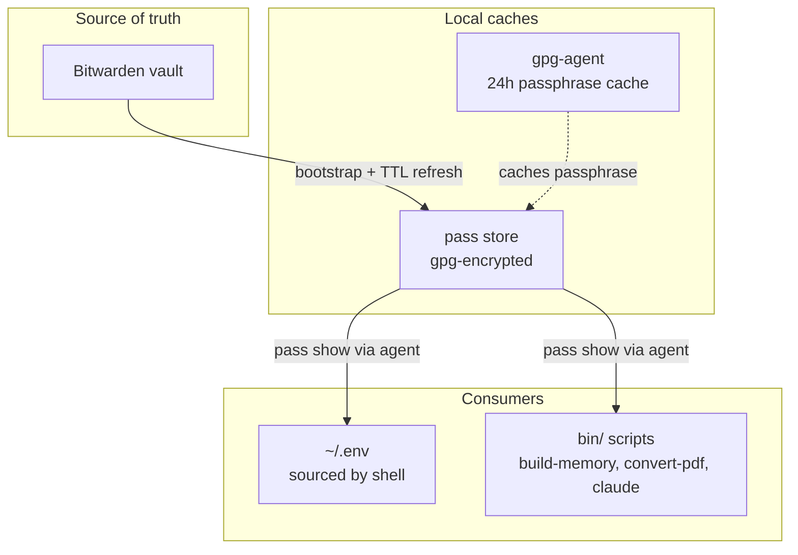
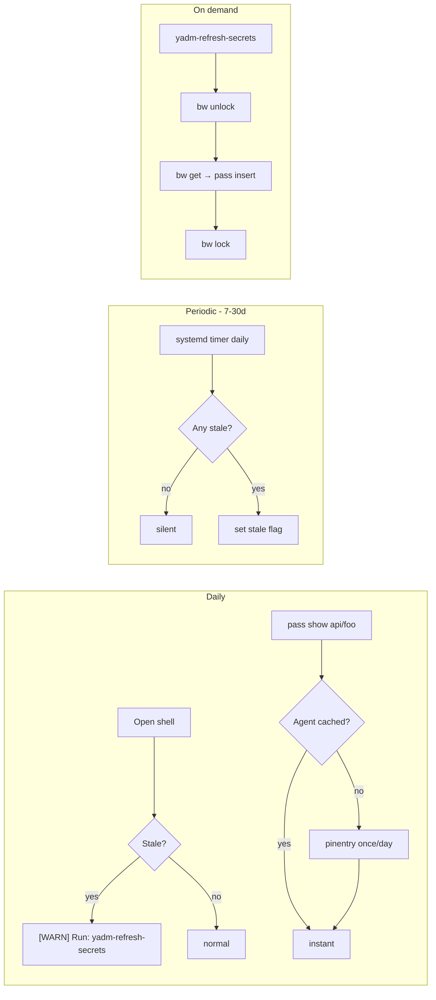
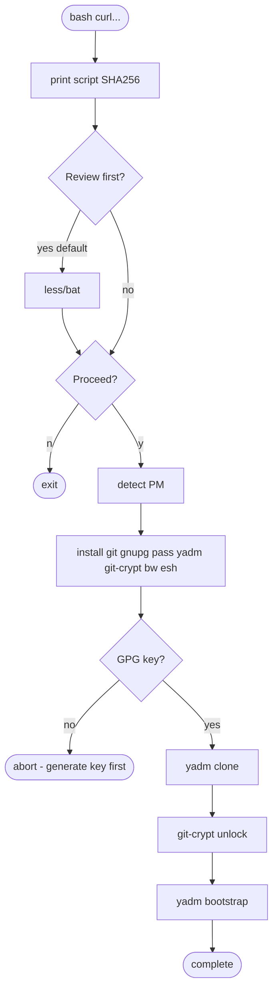
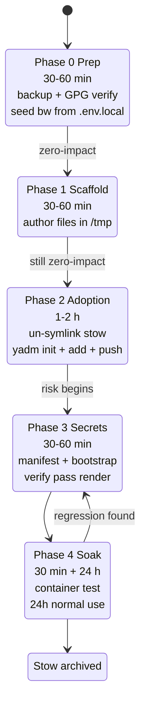
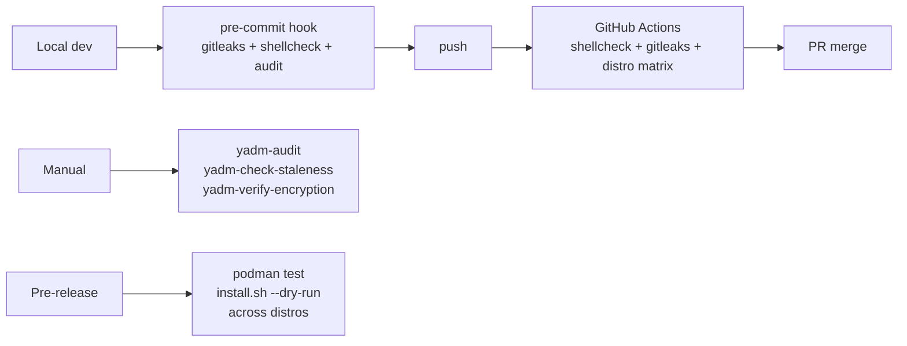

# Dotfiles Plan — At a Glance

Migration from GNU Stow → yadm + Bitwarden + pass, big-bang in 5 phases.

---

## The Stack

Three caches, three rhythms: **Bitwarden** (monthly), **pass** (7-30d TTL), **gpg-agent** (daily unlock).

---

## Key Decisions

| # | Decision | Why |
|---|---|---|
| 1 | **yadm** over chezmoi | Real files, git-native feel, low lock-in |
| 2 | **Bitwarden → pass → tools** tiered | Daily reads don't need bw unlock |
| 3 | **One GPG key** | Covers pass + yadm encrypt + git-crypt + commit signing |
| 4 | **esh** template engine | Maintained single-file shell script |
| 5 | **git-crypt** for encrypted docs | Transparent per-file, editable in place |
| 6 | **Manifest-driven template (B.1)** | Single source of truth; generated template gitignored |
| 7 | **Big-bang migration** in 5 phases | User doesn't rely on current setup heavily |
| 8 | **`bash <(curl …)` installer** | Inspectable, trace-logged, dry-run supported |

---

## Secrets Lifecycle

---

## Bootstrap Flow

---

## Migration Phases

---

## Leakage Defences (Layered)

| # | Layer | Catches |
|---|---|---|
| 1 | Structural: rendered outputs gitignored | Accidental `yadm add` of rendered `.env` |
| 2 | Pre-commit: gitleaks + shellcheck | Entropy patterns, script bugs |
| 3 | Pre-push: gitleaks --staged | Bypassed pre-commits |
| 4 | yadm encrypt + git-crypt | SSH keys + secret docs never plaintext in repo |
| 5 | `yadm-verify-encryption` | Encryption gaps (files that should be encrypted but aren't) |
| 6 | `.gitconfig##template.esh` class branching | Wrong identity on commits |
| 7 | Explicit denylist | Files that must never leave the machine |

---

## Verification Strategy

Five layers: pre-commit → on-demand → container → CI → manual post-migration checklist. Seven failure modes, each caught by at least one automated layer.

---

## Repo Scope

**Tracked:** `.zshrc` et al., `.config/{nvim,btop,cheat,laio,pomodoro,speech-dispatcher}`, `.claude/rules/`, `bin/`, `.config/yadm/`, `docs/`.

**Denylist:** `.claude.json`, `.env` (rendered), `.cache/`, `.local/share/`, language version managers (`.pyenv`, `.nvm`, `.cargo`, `.bun`), `.claude/projects/`.

**Encrypted:**
- `docs/secret/**` → git-crypt (editable, transparent)
- SSH keys, GPG backups → `yadm encrypt` (opaque archive)
- `.env` → gitignored, rendered from template

---

## Next Steps

1. Review full spec (see **Design Spec** tab)
2. Verify no surprises in the transcript (see **Transcript** tab)
3. Invoke `writing-plans` skill to produce a concrete implementation plan
4. Execute Phase 0 when ready
